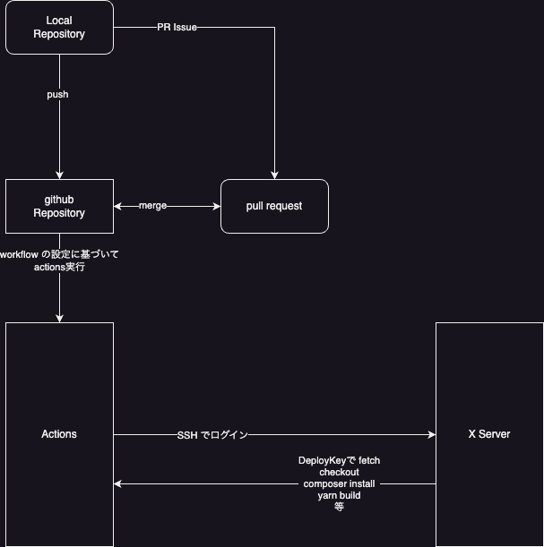

# GithubのプライベートリポジトリからXサーバーへSymfonyAppをデプロイする設定

Backlogの利用廃止にともない、Githubのリポジトリを利用するにあたって、自動デプロイするための各所の設定について

- Githubでリポジトリを作成する
- Xサーバーのコンパネ上で行う設定
- XサーバーへSSHでログインして行う設定1 各種インストールとgithub公開鍵発行
- githubのPATを発行する
- サイト設定 サイトをチェックアウトする
- 自動デプロイ設定をする(Actions)

# 登場人物

## github

githubの`triple-E-Japan-inc`organization上にリポジトリを用意する

[triple-E-Japan-inc organization](https://github.com/triple-E-Japan-inc)

### リポジトリ

githubにサイトのドメイン毎にプライベートリポジトリを作り、ソースコードの共有を行う

### Deploy Keys

**Xサーバーからgithubへ**接続するためのSSH公開鍵をgithubへ登録する

### Actions

githubのリポジトリへプッシュされた時に、指定したブランチの時に指定した処理をgithub上で実行させる機能

これを利用してgithubからXサーバーへログインして対象のブランチをチェックアウトしたり、github上でビルドを行いFTPでリリースしたりする

## Xサーバー

実際にホスティングを行う環境

### SSHキー

**Xサーバーへログインする**ための公開鍵

先のDeployKeyとは違う向きのSSHログインになるので混同しない様に注意

Xサーバーのコンパネから発行する

### ドメイン設定

Xサーバーでサイトをホスティングできる様にドメインを割り当てる。

合わせてドメイン管理サービス(お名前.com ムームードメイン Xドメインなど)でDNSレコードを設定する必要がある

SSLの設定もここで行う

# 自動デプロイの流れ

- ローカルリポジトリで作業ブランチをコミット、githubのリポジトリにプッシュする
- githubにてPullRequestを発行
- `main`もしくは`stg`へマージされる
- `workflows`の設定ファイルの内容に基づいて GithubActionsが起動する (自動)
- GithubからXサーバーへSSHでログイン (自動)
- Xサーバー側から githubのリポジトリへアクセス、`git fetch`と`git checkout`を実行する (自動)
- さらに`composer install`と`yarn install`と`yarn build`コマンドを実行する (自動)

symfonyの設定で`composer install`時にキャッシュクリアも実行される

