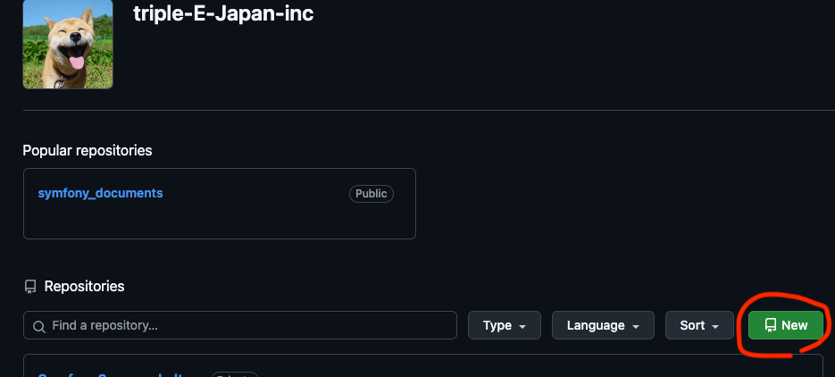
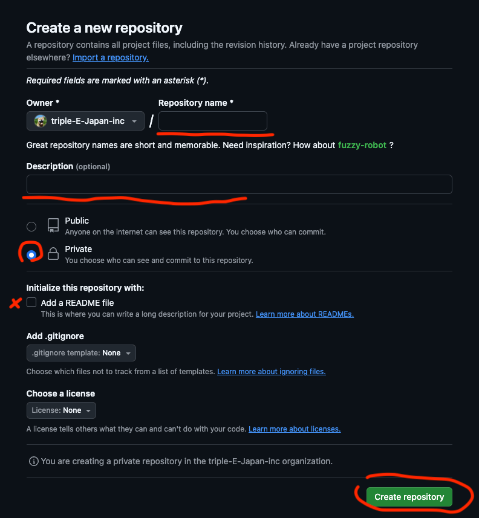
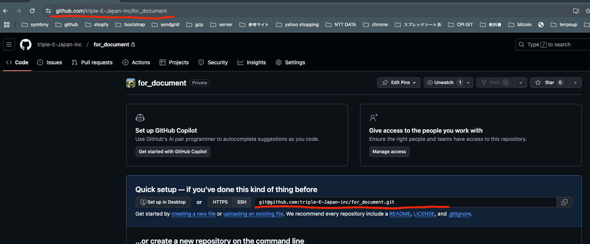

# githubにてリポジトリを作成する

organizationのTOPから新規リポジトリ作成へ進む

[triple-E-Japan-inc organization](https://github.com/triple-E-Japan-inc)



作成画面では

- `Repository name` : 基本的にドメイン名を設定する ex. triple-e.inc
- `Description` : リポジトリの説明。サイトの説明を記述 ex. Triple E Japan コーポレートサイト
- リポジトリの種類は `Private`を選択
- `Add a README file` はOFF
- `Add .gitignore` / `Choose a license` は Noneを選択

`Create repository`を押下



リポジトリが作成できたのでリポジトリのURLをメンバーに共有する

- リポジトリページのURL
- リポジトリのSSHでのURL



## ローカル開発開始

一旦これでローカルで開発ができる様になったので、通常のサイト構築の場合は以下コマンドで雛形を用意して作業開始する

```
$ git clone -b update_7.1 git@github.com:triple-E-Japan-inc/Symfony6_cms_skelton.git app

Cloning into 'Symfony6_cms_skelton'...
Enter passphrase for key '/Users/nagayashintarou/.ssh/id_rsa': {id_rsaのパスフレーズ}
remote: Enumerating objects: 2277, done.
remote: Counting objects: 100% (457/457), done.
remote: Compressing objects: 100% (321/321), done.
remote: Total 2277 (delta 214), reused 307 (delta 120), pack-reused 1820 (from 1)
Receiving objects: 100% (2277/2277), 1.31 MiB | 1.66 MiB/s, done.
Resolving deltas: 100% (1281/1281), done.
```

クローンコマンド

```
git clone -b {ブランチ名} {リポジトリURL} {ローカルに作成するディレクトリ名}
```

入ってきたgitディレクトリを削除して新しくリポジトリを作成する

```
$ cd app
$ rm -rf .git
$ git init
```

リモートを設定する

```
$ git remote add origin git@github.com:triple-E-Japan-inc/for_document.git
```

remote addコマンド

```
$ git remote add {識別名} {リポジトリのSSHでのURL}
```

初期設定

```
$ composer install

$ yarn install

$ yarn build

// 各種ローカル用設定
$ php bin/console app:init
```

!!! プロジェクト開始時の初回のみ・シークレットを生成する

```
$ php bin/console app:init:regenerate_secret
```

出てきた文字列を`.env`の`APP_SECRET=`の値と差し替える

シーディング

```
$ php bin/console doctrine:database:create
$ php bin/console doctrine:migrations:migrate
$ php bin/console app:seed
```

初コミットとプッシュ

```
// ファイルをステージングする
$ git add *

// コミット
$ git commit -m 'first commit'

// push
$ git push origin main
```

