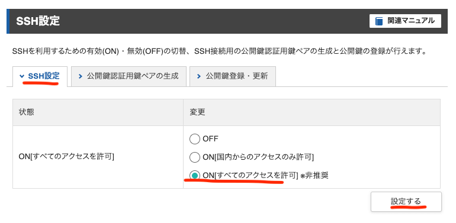

# Xサーバーのコンパネでの設定

Xサーバーのコンパネ上で行う設定

!!! 実行するサーバーですでに設定済みの場合は、この章を飛ばす

## サーバー情報を控える


- サーバー番号
- ホスト名
- IPアドレス
- ホームディレクト

を控えておく


## SSHキーを発行

Xサーバーへログインするための公開鍵を発行する


`公開鍵認証用鍵ペアの生成` タブへ進み、パスフレーズを設定する

パスフレーズはサーバー情報のホームディレクトリの情報のうち、`home/`以降の`xs0000`を設定する

`/home/xs205163`の場合、`xs2051`をパスフレーズにする

! Xサーバーのプランによってこの条件にならない場合もある

`確認画面へ進む` > `登録する`


鍵ファイルがダウンロードされるので、ローカルに保存する

```
// ダウンロードフォルダにて
$ mv xs205163.key ~/.ssh/

// パーミッションを変更
$ cd ~/.ssh
$ chmod 0600 xs205163.key
```

`xs205163.key`はダウンロードしたファイル名に読み替える

#### ローカルでの設定

SSH設定をする

```
$ vi config

host x_server_xxxx
  HostName sv14805.xserver.jp
  User xs205163
  IdentityFile ~/.ssh/xs205163.key
  Port 10022
```

`host`の部分は自分がわかる識別名にする

### サーバーのSSHを有効にする

鍵を出力してもまだサーバーのSSLが有効になっていないので設定する。

SSH設定タブを押下

`ON[すべてのアクセスを許可]`を選択、`設定する`を押下

全てのアクセスを許可にするのは、国内からのアクセスのみ許可の場合ではGitHUbからアクセスができないため



### SSHでログインしてみる

```
$ ssh x_server_xxxx
```

初回の場合はSSH情報を受け入れるか尋ねられるので、`yes`にする

Xサーバー上で設定したパスフレーズを入力

Xサーバーへログインできるか確認する。ログインできたら一旦 `logout`で退出する

