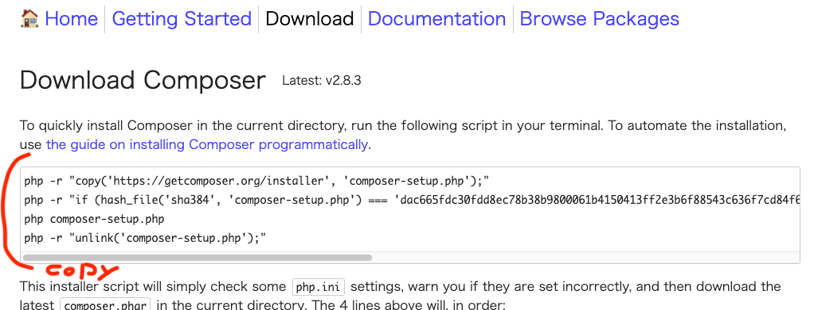
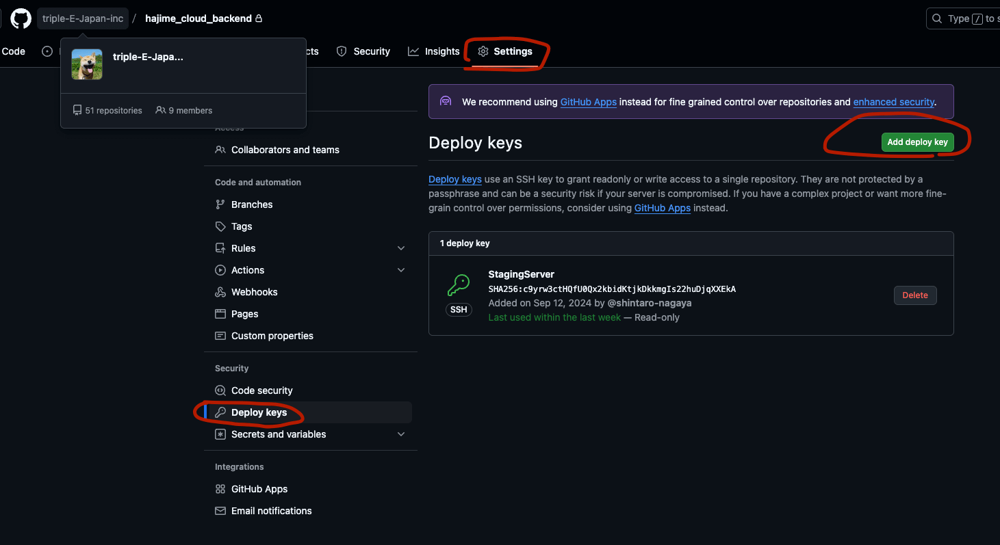
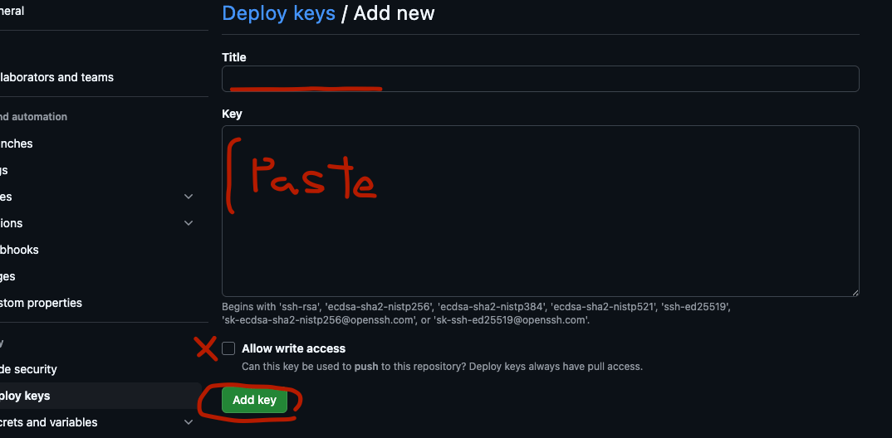

# XサーバーへSSHでログインして行う設定1

!!! サーバーで設定済みの場合はこの章はスキップする

SSHでログイン

```
$ ssh x_server_xxxx
```

以降はXサーバー上での操作となる

サーバー上で必要な設定を行う

- phpコマンドのパスを通す
- composerをインストール
- node JS をインストール
- yarn のインストール
- deploy keyを発行

## PHPコマンドのパスを通す

デフォルトではPHPのバージョンが低いので、最新版にする

```
$ vi ~/.bashrc

// ファイルに追加
alias php='/usr/bin/php8.2'
```

viから退出して反映させる

```
$ source ~/.bashrc
```

バージョン確認

```
$ php -v
PHP 8.2.22 (cli) (built: Aug  5 2024 10:25:13) (NTS)
Copyright (c) The PHP Group
Zend Engine v4.2.22, Copyright (c) Zend Technologies
```

8.2系になっていればOK

## Composerをインストールする

https://getcomposer.org/download/
をブラウザで開く

インストールスクリプトをコピーする



SSHでペーストする

```
$ php -r "copy('https://getcomposer.org/installer', 'composer-setup.php');"
$ php -r "if (hash_file('sha384', 'composer-setup.php') === 'dac665fdc30fdd8ec78b38b9800061b4150413ff2e3b6f88543c636f7cd84f6db9189d43a81e5503cda447da73c7e5b6') { echo 'Installer verified'; } else { echo 'Installer corrupt'; unlink('composer-setup.php'); } echo PHP_EOL;"
$ php composer-setup.php
$ php -r "unlink('composer-setup.php');"
```

ルートディレクトリに`composer.phar`ができているのを確認する

composerのパスを通す

```
$ vi ~/.bashrc

// ファイルに追加
alias composer='/usr/bin/php8.2 ~/composer.phar'
```

viから退出して反映させる

```
$ source ~/.bashrc
```

反映を確認

```
$ composer -v
   ______
  / ____/___  ____ ___  ____  ____  ________  _____
 / /   / __ \/ __ `__ \/ __ \/ __ \/ ___/ _ \/ ___/
/ /___/ /_/ / / / / / / /_/ / /_/ (__  )  __/ /
\____/\____/_/ /_/ /_/ .___/\____/____/\___/_/
                    /_/
Composer version 2.6.5 2023-10-06 10:11:52
```

## NodeJSをインストールする

```
$ curl -L git.io/nodebrew | perl - setup
```

ホームに`.nodebrew`が入った。
パスを通してみる

```
$ echo 'export PATH=$HOME/.nodebrew/current/bin:$PATH' >> ~/.bashrc
```

参考文献の通りに改行が入っていないのでコメントアウト行の最後に追記されてしまっている

改行を入れて

```
# User specific aliases and functionsexport

PATH=$HOME/.nodebrew/current/bin:$PATH
```

となる様に修正して反映

```
$ source .bashrc 
$ nodebrew -v
nodebrew 1.2.0
```

### nodebrewでインストール

v16系を入れる

```
$ nodebrew install v16.20.2
$ nodebrew use v16.20.2
$ node -v
v16.20.2
$ npm -v
8.19.4
```

## yarnのインストール

```
$ npm install yarn
```

パスを通す

```
$ vi ~/.bashrc

export PATH=$HOME/.nodebrew/current/bin:$HOME/node_modules/yarn/bin:$PATH
```

exportに `$HOME/node_modules/yarn/bin`を追加

反映

```
$ source ~/.bashrc
$ yarn -v
1.22.19
```

### DeployKeyを発行

Xサーバーからgithubへ接続するための公開鍵を発行する

鍵の名前を定義しておく。ドメイン名などからユニークなものを設定する

ここでは `example_jp`としておく

```
$ cd ~/
// ssh-keygen -f .ssh/{ 秘密鍵の名前 } 
$ ssh-keygen -f .ssh/example_jp
```


パスフレーズは無しにする

```
Generating public/private rsa key pair.
Enter passphrase (empty for no passphrase): [そのままエンター]
Enter same passphrase again: [そのままエンター]
Your identification has been saved in .ssh/example_jp.
Your public key has been saved in .ssh/example_jp.pub.
```

configファイルを作成

SSHホスト名のエイリアスを定義しておく

ここでは`example_jp_github`としておく

```
$ vi .ssh/config

# Host {SSHホスト名のエイリアス}
Host example_jp_github
  HostName github.com
  User git
  IdentityFile ~/.ssh/github
```

パーミッションを変更しておく

```
$ chmod 600 .ssh/config
```

公開鍵の内容をコピーする

```
$ cd ~/
// cat .ssh/{ 公開鍵 }
$ cat .ssh/example_jp.pub

ssh-rsa AAAAB3NzaC1yc2EAAAADAQ......4YS4wtbGm5WnOM7rrsofnqNZWGsd77mTv3YJlo9 xs205163@sv14805.xserver.jp
```

#### 公開鍵をgithubへ登録する

ここからgithubの画面で実行



`Settings` > `Deploy Keys` > `Add deploy key` を押下



`Title`に名称を入れる (Xサーバーデプロイとか)

`Key` にさっきコピーした公開鍵をペーストする

`Allow write access`はOFF

`Add key`を押下

#### 接続確認

XサーバーのSSHに戻る

```
// ssh -T {SSHホスト名のエイリアス}
$ ssh -T example_jp_github
Hi {repository name}! You've successfully authenticated, but GitHub does not provide shell access.
```

これが出ればOK
