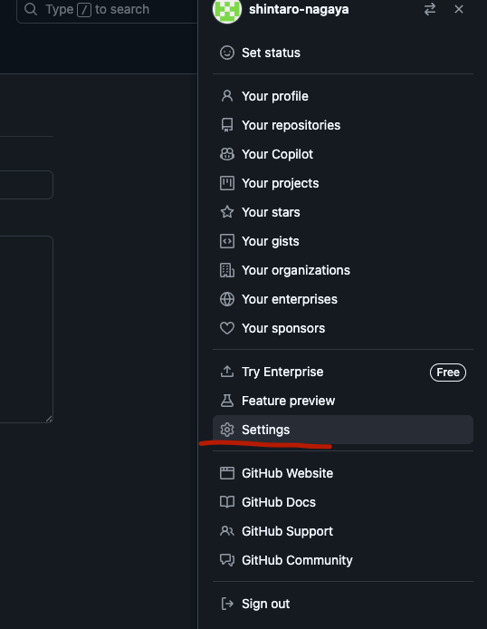
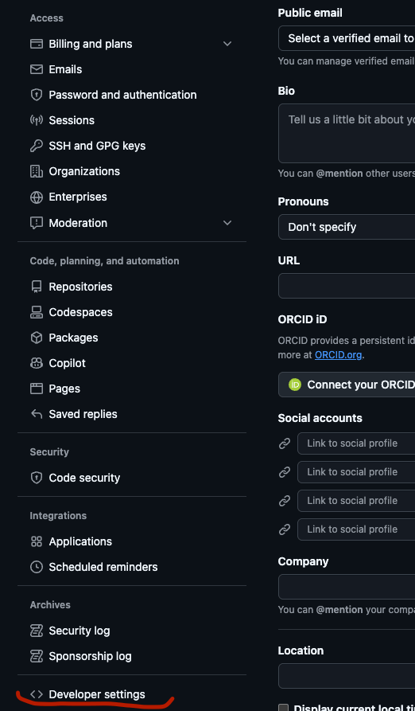
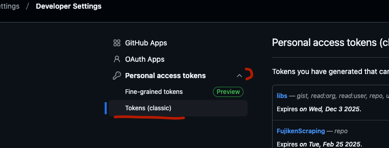
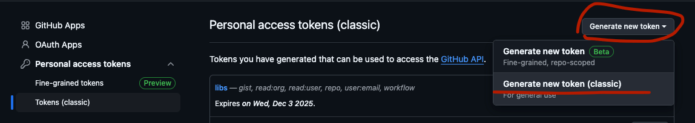
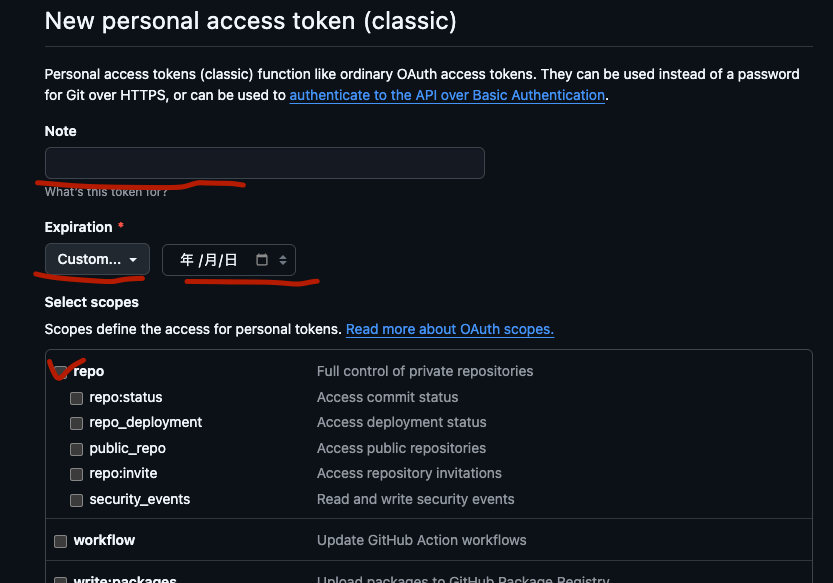

# githubのPATを発行する

!!! 発行済み・期限内の場合はこの章をスキップ

githubの依存リポジトリにアクセスするために PAT パーソナルアクセストークン を発行する

githubの画面右上のアイコン押下から出てくるメニューの `Settings` >
左メニュー最下の `Developer settings` > `Personal access tokens` > `Tokens (classic)`

右上の `Generate new token` > `Generate new token (classic)` へ

`Note`にトークン名を記入(分かればなんでもいい)

`Expiration`は `Custom`を選択してカレンダー入力でできるだけ長い日付を選択 (1年くらい)

`Select scopes`は `repo`にチェック

ページ下段の`Generate token`を押下

ページ遷移して出てくるトークン文字列をコピーして、自分のメモなどに残しておく(slackの自分のDMなど)

画面遷移して消えてしまうと再生成する必要がある
