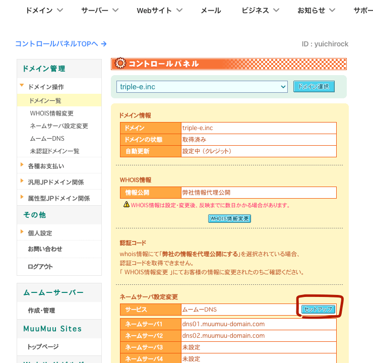
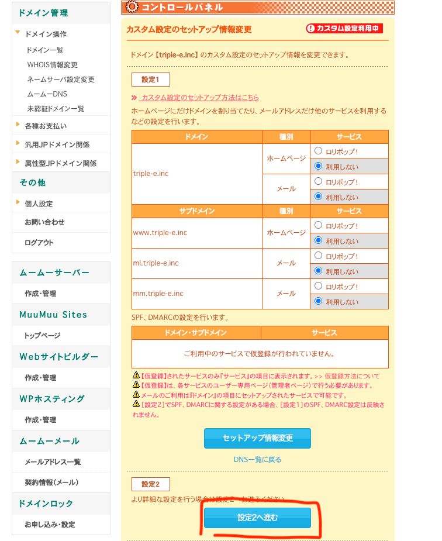
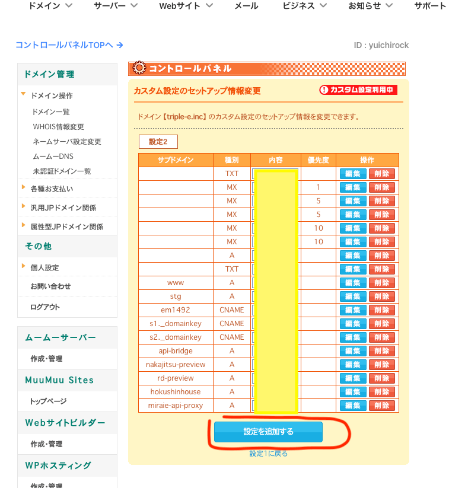
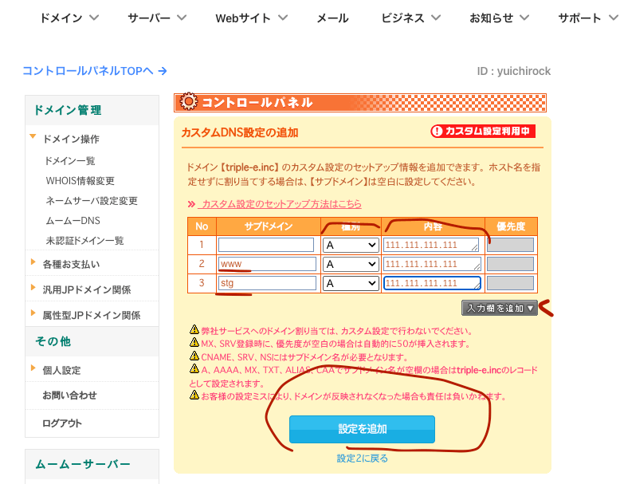
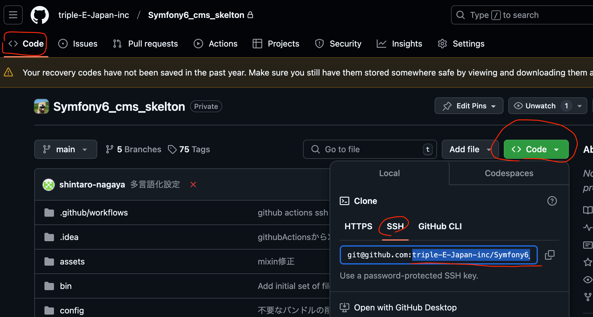

# サイトデプロイ設定1

これは各サイト毎に実行する

- ドメイン管理でAレコードを設定
- Xサーバーでサイト登録
- githubのリポジトリからチェックアウトする
- 各種インストールと設定

## ドメイン管理でAレコードを設定

トリプルイーの場合はムームードメインで管理するドメインが多いので、ムームードメインのコンパネでAレコードを設定する

先方管理のドメインやサイトの引っ越しなど、このタイミングでAレコードの書き換えが行えない場合はスキップする

### ムームーDNS設定へ

ムームーコンパネのドメイン操作から ネームサーバー設定変更の「セットアップ」を押下


設定2へ進むを押下



設定を追加するを押下



「入力欄を追加」を押下して欄を3つにする

サブドメインは上から 空白、 「www」「stg」とする

種別は全て A 内容に [サーバー情報を控える](./3_setup_x_control.md) で控えておいたIPアドレスを入力

「設定を追加」を押下



また、登録するドメインでメールを使用する場合、MXレコードとSPFレコードを設定する

| サブドメイン | 種別  | 値                                                                                  | 優先度 |
|--------|-----|------------------------------------------------------------------------------------|-----|
|        | A   | 162.43.101.6                                                                       |     |
| www    | A   | 162.43.101.6                                                                       |     |
| stg    | A   | 162.43.101.6                                                                       |     |
|        | MX  | example.com                                                                        | 50  |
|        | TXT | v=spf1 +a:sv13250.xserver.jp +a:example.com +mx include:spf.sender.xserver.jp ~all |     |

SPFの `+a:sv00000.xserver.jp`の部分は  [サーバー情報を控える](./3_setup_x_control.md) で控えておいたホスト名を入れる

`+a:example.com`はそのままドメイン名

## Xサーバーでサイトの登録をする

Xサーバーのコンパネに入る

### 独自ドメインの設定

Xサーバーのサーバー管理 > ドメイン内 ドメイン設定 > ドメイン設定追加タブ

ドメイン名を入力 `example.com`

```
無料独自SSLを利用する（推奨）
高速化・アクセス数拡張機能「Xアクセラレータ」を有効にする（推奨）
```

はONで良い

`確認画面へ進む` > 登録する

上記DNSの浸透がまだの場合は無料SSLの取得に失敗するがあとで設定しなおせる

また、サイト引っ越しなどの場合はまだDNSレコードが設定されてない状態なので、`無料独自SSLを利用する`はOFFでよい

### stg サブドメイン

Xサーバーのサーバー管理 > ドメイン内 サブドメイン設定 > ドメイン選択画面から`選択する` > サブドメイン設定追加タブ

サブドメイン名 `stg`

ドキュメントルートを `example.com/public_html/(サブドメイン名)/` の方を選択

`無料独自SSLを利用する`をON

`確認画面へ進む` > 登録する

## Basic認証をかけておく

Xサーバーのサーバー管理 > ホームページ内 アクセス制限 > ドメイン選択画面から`選択する`

対象設定ドメイン `example.com`

現在のフォルダ > `ユーザー設定`

ユーザーIDとパスワードを入力 > `確認画面へ進む` > 登録する

フォルダ一覧へ戻り`現在のフォルダ` > ON / OFF を ONに > `設定する`

## 独自SSL設定

まずドメイン設定が反映しているのを確認する。`example.com`をブラウズしてXサーバーの初期画面がでていれば反映している。お待ちくださいなどのメッセージがでている場合はまだ反映されていない

Xサーバーのサーバー管理 >ドメイン内 SSL設定 > ドメイン選択画面から`選択する` > 独自SSL設定追加タブ

対象ドメイン `www.example.com`

`CSR情報(SSL証明書申請情報)を入力する`はOFF

`確認画面へ進む` > 登録する

続いて `stg.example.com`も同様に設定

## PHP Ver切り替え

Xサーバーのサーバー管理 > PHP内 PHP Ver.切替 > ドメイン選択画面から`選択する`

対象のドメイン `example.com`

変更後のバージョン `PHP8.2.22` (2024年12月現在)

`変更`

## DB作成

Xサーバーのサーバー管理 > データベース内 MySQL設定 > MySQL追加タブ

名称は半角英数10文字以内で

MySQLデータベース名 xs121977_`任意名称`

文字コード `UTF-8`

`確認画面へ進む` > 登録する

MySQLユーザー追加タブへ

ユーザーIDは xs121977_ `半角英数字7文字`・パスワードは半角英数字15文字で

`確認画面へ進む` > 登録する

MySQL一覧タブへ

作成したデータベースの`アクセス権未所有ユーザ`を上記で作成したユーザー選択して`追加`

## メールアカウント作成

ここではお問い合わせフォームなどで使用するSMTPアカウントを作成する

Xサーバーのサーバー管理 > メール内 メールアカウント設定 > ドメイン選択画面から`選択する` > メールアカウント追加タブ

メールアカウント `app`@example.com

パスワード 半角英数15文字

容量 2000 MB

コメント 任意入力

`確認画面へ進む` > 登録する

### info@example.com

クライアントがメールを使用しないが、`info@`で受信をして使用している別メールへ転送したい、場合は上記手順で `info`
@example.com も作っておく

Xサーバーのサーバー管理 > メール内 メールアカウント設定 > ドメイン選択画面から`選択する` > メールアカウント一覧タブ

info@example.com の`転送`へ

メールボックスに残すかどうかの設定 `残さない` にするため `変更` >  `変更する`

転送先アドレスに別メールを入力 > `追加する`

## githubのリポジトリからチェックアウトする

XサーバーにSSHでログインする

```
$ ssh x_server_xxxx
```

以後Xサーバー上での操作

## 初回は手動でチェックアウトする

git repositoryのSSHパスを取得する

`Code` > `Local` > `SSH` URLの `:`以降の部分をコピー

SSHホストのエイリアスと組み合わせる

```
{SSHホストのエイリアス}:{githubからコピーしてきたRepositoryURL}
example_jp_github:triple-E-Japan-inc/example.com.git
```



### チェックアウト
```
$ cd site_domain.com
## git clone --mirror {上記リポジトリURL} .git
$ git clone --mirror example_jp_github:triple-E-Japan-inc/example.com.git .git

// clone

$ git fetch
$ git --work-tree=./ checkout main -f
```

ソースコードが展開される

## 設定する

basicAuthの `.htaccess`がすでにあるので、一旦リネームしておく

```
$ mv public_html/.htaccess public_html/.htaccess1

$ composer install

$ php bin/console app:init
```

DBやSMTPやrecaptchaV3を上記で作成した情報を入力、アップロードディレクトリはデフォルトの`var/upload/`に、FTPデプロイ設定は無設定でOK。

`.htaccess`が新たに作られているので、先ほどリネームした`.htaccess1`に記載されている内容を新しい`.htaccess`に転記しておく。
また、SSLリダイレクトのコメントアウトも外しておく

```
$ vi public_html/.htaccess

# BasicAuthの記述をコピーしてくる
SetEnvIf Request_URI ".*" Ngx_Cache_NoCacheMode=off
SetEnvIf Request_URI ".*" Ngx_Cache_AllCacheMode
AuthUserFile "/home/xs121977/example.com/htpasswd/.htpasswd"
AuthName "Member Site"
AuthType BASIC
require valid-user

...

<IfModule mod_rewrite.c>
    RewriteEngine On

    # SSL 以下４行のコメントアウトを外す
    RewriteCond %{HTTPS} off
    RewriteRule ^(.*)$ https://%{HTTP_HOST}%{REQUEST_URI} [R=301,L]
    RewriteCond %{HTTP_HOST} !^www\. [NC]
    RewriteRule .* https://www.%{HTTP_HOST}%{REQUEST_URI} [L,R=301]
```

シードしておく

```
$ php bin/console app:seed --refresh
```

ここでは管理ページアカウントは本番のものを設定する

## ビルド

```
$ yarn build
```

完了したらブラウザで確認

## ステージング環境

ステージングを作成する

`~/example.com/`内に`stg`ディレクトリを作成して本番と同様にバックログのリポジトリからクローン。
チェックアウトするブランチを`stg`にする

```
$ mkdir stg
$ cd stg
$ git clone --mirror {リポジトリURL} .git

// clone

$ git fetch
$ git --work-tree=./ checkout stg -f
$ composer install
$ php bin/console app:init
```

アップロードディレクトリを`../var/upload`にする以外は本番と同じ。シードは行わない。`yarn build`でビルドしておく

`.htaccess`を編集

```
$ vi public_html/.htaccess

<IfModule mod_rewrite.c>
    RewriteEngine On

    # SSL 以下2行のコメントアウトを外す
    RewriteCond %{HTTPS} off
    RewriteRule ^(.*)$ https://%{HTTP_HOST}%{REQUEST_URI} [R=301,L]
#    RewriteCond %{HTTP_HOST} !^www\. [NC]
#    RewriteRule .* https://www.%{HTTP_HOST}%{REQUEST_URI} [L,R=301]
```

### ステージング環境をシンボリックリンクにする

Xサーバーのサブドメインは本番の`public_html`配下に固定されているので、`~/example.com/public_html/stg`
ディレクトリをシンボリックリンクに変更する

まずステージングのドキュメントルートの絶対パスを調べる

```
$ cd ~/example.com/stg/public_html
$ pwd
/home/xs121977/example.com/stg/public_html
```

`pwd`ででてきたパスをコピーしておく

```
# 本番のドキュメントルートへ移動
$ cd ~/example.com/public_html

# 元からある stgディレクトリを削除 !! この行は失敗が許されないので要注意 !!
$ rm -rf stg

# さっきコピーしたパスにシンボリックリンク作成
$ ln -s /home/xs121977/example.com/stg/public_html stg
```

`https://stg.example.com`をブラウズして確認